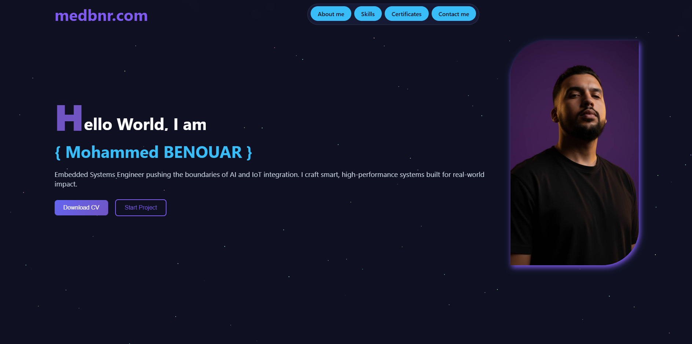
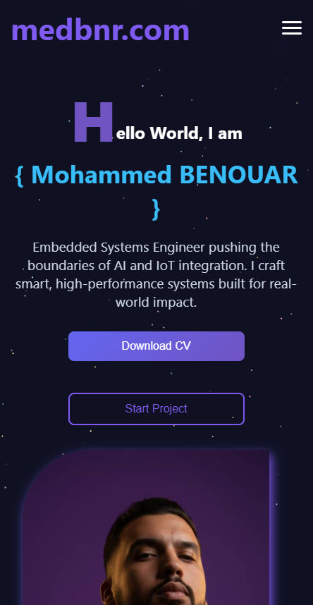

# medbnr
[]()

A personal / portfolio web project built by **Mohamed BENOUAR** (medbnr).  
Showcases profile, skills, projects, certificates, and contact info. Deployed at: https://medbnr.com :contentReference[oaicite:0]{index=0}
  

## Preview

### Desktop  
[](./desktopsc.png)

### Mobile  
[](./mobilesc.png)

*(Click on the images to view in full size)*


## Features

- Landing page  
- About section  
- Skills and certificates showcase  
- Projects / portfolio gallery  
- Contact section  
- Responsive design (works on desktop and mobile)  

## Usage

1. Clone the repository:
   ```bash
   git clone https://github.com/BENOUARMohamed/medbnr.git
   cd medbnr
Open the index.html file directly in your browser.
No extra setup or dependencies are required.

Folder Structure
yaml
Copy code
/

├── index.html        # Main entry point

├──url/               #css and javascript

├── images/           # Images and icons

├── Screenshot 2025-09-24 151659.png   # Desktop preview

├── Screenshot 2025-09-24 151913.png   # Mobile preview

└── README.md         # This file
Contributing
Contributions are welcome!

Fork the repository

Create a new branch: feature/your-feature

Commit your changes

Push to your branch and open a Pull Request

License
This project is licensed under the MIT License.

Contact
Author: Mohammed Benouar

GitHub: BENOUARMohamed
